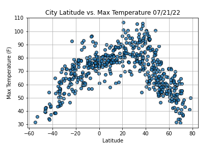
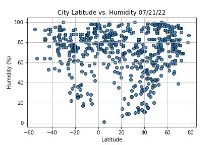
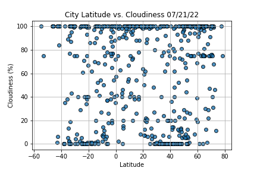
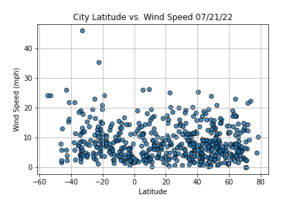
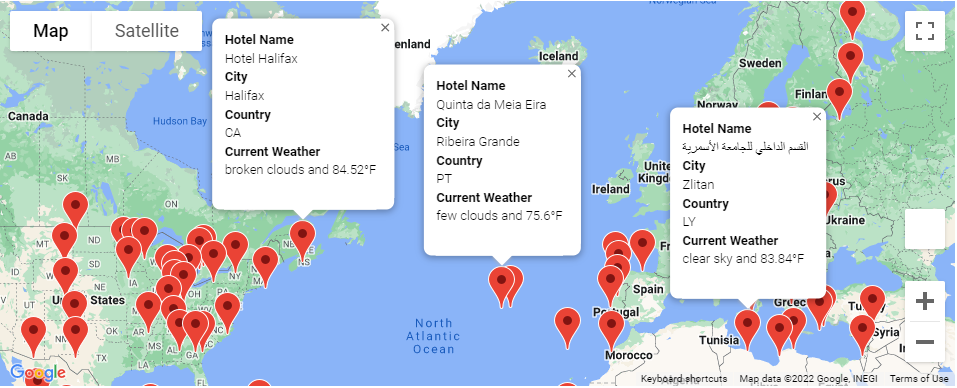
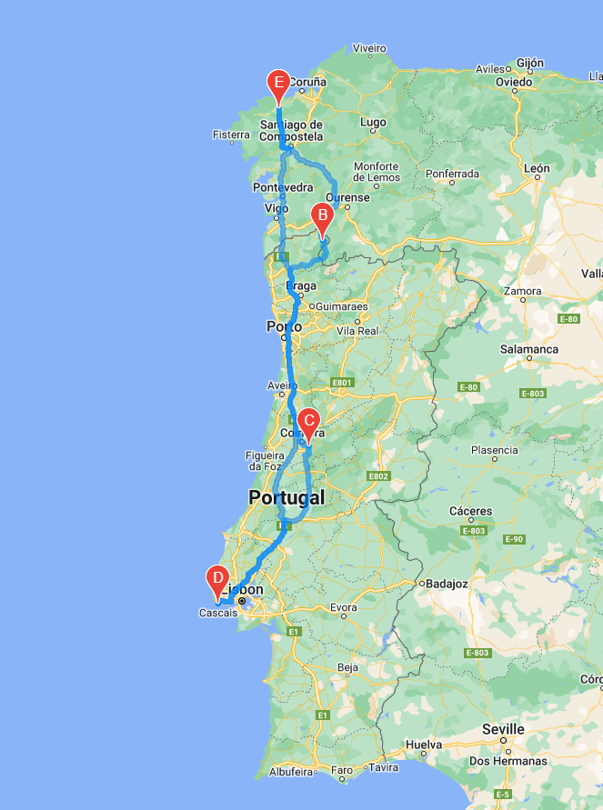
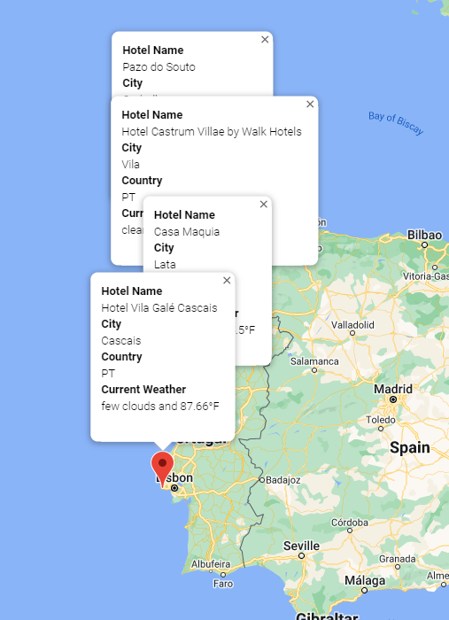

# World_Weather_Analysis

## Purpose

Retrieve weather data, create a customer travel destinations map, and create a travel itinerary map.

### Weather Data

### Destination Map

### Travel Itinerary Map

